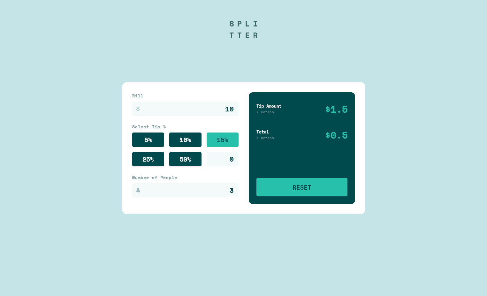

# Frontend Mentor - Tip calculator app solution

This is a solution to the [Tip calculator app challenge on Frontend Mentor](https://www.frontendmentor.io/challenges/tip-calculator-app-ugJNGbJUX). Frontend Mentor challenges help you improve your coding skills by building realistic projects.

## Table of contents

- [Overview](#overview)
  - [The challenge](#the-challenge)
  - [Screenshot](#screenshot)
  - [Links](#links)
- [My process](#my-process)
  - [Built with](#built-with)
  - [What I learned](#what-i-learned)
  - [Continued development](#continued-development)
  - [Useful resources](#useful-resources)
- [Author](#author)
- [Acknowledgments](#acknowledgments)

**Note: Delete this note and update the table of contents based on what sections you keep.**

## Overview

### The challenge

Users should be able to:

- View the optimal layout for the app depending on their device's screen size
- See hover states for all interactive elements on the page
- Calculate the correct tip and total cost of the bill per person

### Screenshot

### Links

- Solution URL: [Add solution URL here](https://www.frontendmentor.io/challenges/tip-calculator-app-ugJNGbJUX/hub/nextjs-and-css-grid-FTQf89IWW)
- Live Site URL: [Add live site URL here](https://fm-calculator-app-i3chmjzyb-tonytangdev.vercel.app/)

## My process

### Built with

- Semantic HTML5 markup
- CSS custom properties
- Flexbox
- CSS Grid
- Mobile-first workflow
- [Next.js](https://nextjs.org/) - React framework

### What I learned

Use of CSS Grid for responsive design

## Author

- Frontend Mentor - [@tonytangdev](https://www.frontendmentor.io/profile/tonytangdev)
- Twitter - [@tonytangdev](https://twitter.com/TangTangdev)

## Acknowledgments

Congrats to myself for completing the challenge by myself 🎉
